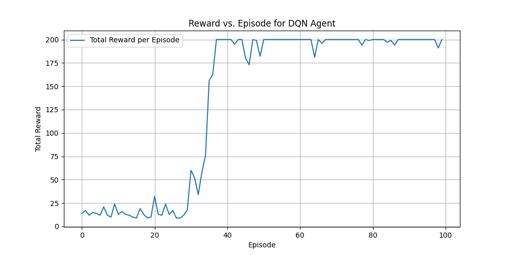

# 使用深度强化学习实现木棍小车平衡

## 文件结构

* `code/`：代码。
* `Task.pdf`: 任务描述。
* `data/`：所需要的数据。

## 运行

```Shell
pip install -r requirements.txt
python main.py
```

## 创新点

- 改用 DDQN 算法，详见 `lab10/code/agent_dir/agent_dqn.py` 的 116 - 117 行。
- 使用带有优先级的经验回收池，优先采样缺乏训练的样本对。

## 可视化

**State of the art，无需多言。**

