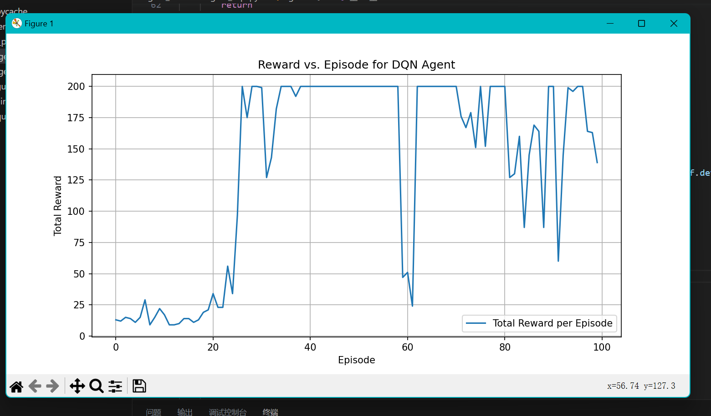

# 使用深度强化学习实现木棍小车平衡

## 创新点

- 改用 DDQN 算法，关键代码位于 `lab10/code/agent_dir/agent_dqn.py` 的 116 - 117 行。
- 使用带有优先级的经验回收池，优先采样缺乏训练的样本对。

## 运行

```Shell
pip install -r requirements.txt
python main.py
```

## 可视化

20+ 次游玩即可收敛(尽力了)。

