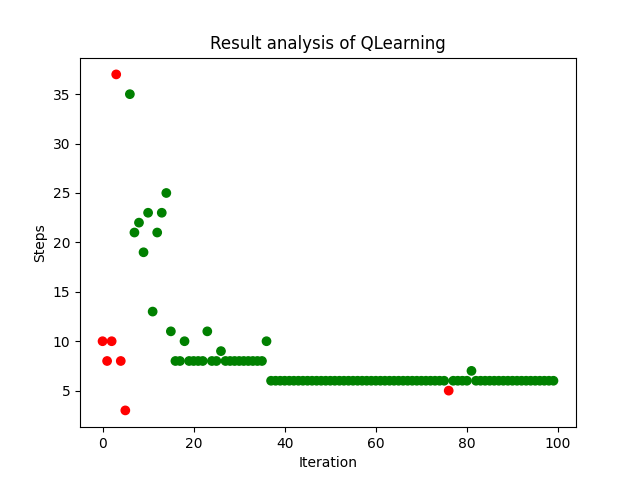
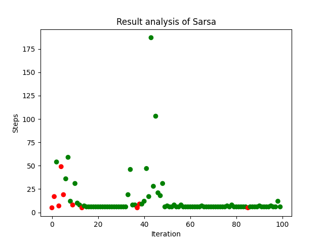

# 使用Q-Learning和SARSA解决迷宫问题

## 文件结构

- `code/`：代码文件夹。
- `Task.pdf`：任务描述。
- `Tutor.pptx`：教学课件。

## 算法原理

### Q-Learning

Q-Learning 是一种无模型的强化学习算法，通过学习动作值函数 $Q(s, a)$ 来指导代理在给定状态 $s$ 下选择最优动作 $a$ 。其核心思想是利用Bellman方程对Q值进行迭代更新，以逼近最优Q值函数 $Q^*(s, a)$ 。

#### 算法步骤

1. **初始化**：初始化 $Q(s, a)$ 对所有状态 $s$ 和动作 $a$ 为任意值（通常为零）。

2. **重复以下步骤，直到收敛**：
    
    - 从当前状态 $s$ 选择动作 $a$ ，通常使用 ε-greedy 策略。
    
    - 执行动作 $a$ ，观察即时奖励 $r$ 和下一个状态 $s'$ 。
    
    - 使用贝尔曼方程更新Q值函数：
      
      $$Q(s, a) \leftarrow Q(s, a) + \alpha \left[ r + \gamma \max_{a'} Q(s', a') - Q(s, a) \right]$$
      
      其中， $\alpha$ 是学习率， $\gamma$ 是折扣因子， $\delta = r + \gamma \max_{a'} Q(s', a') - Q(s, a)$ 即时序差分误差。
    
    - 将状态更新为 $s \leftarrow s'$ 。

### SARSA 算法

SARSA（State-Action-Reward-State-Action）是一种基于在线策略的强化学习算法，与Q-Learning不同的是，SARSA更新Q值时使用的是实际执行的动作值，而不是估计的最优动作值。

#### 算法步骤

1. **初始化**：初始化 $Q(s, a)$ 对所有状态 $s$ 和动作 $a$ 为任意值（通常为零）。

2. **重复以下步骤，直到收敛**：
    - 从当前状态 $s$ 选择动作 $a$ ，通常使用 ε-greedy 策略。
    
    - 执行动作 $a$ ，观察即时奖励 $r$ 和下一个状态 $s'$ 。
    
    - 从状态 $s'$ 选择下一个动作 $a'$ ，通常使用相同的 ε-greedy 策略。
    
    - 更新Q值函数：
      
      $$Q(s, a) \leftarrow Q(s, a) + \alpha \left[ r + \gamma Q(s', a') - Q(s, a) \right]$$
   
      其中 $\delta = r + \gamma Q(s', a') - Q(s, a)$ 即时序差分误差。
    
    - 将状态和动作更新为 $s \leftarrow s'$ ， $a \leftarrow a'$​ 。

### 比较

- **策略性质**：Q-Learning 是一种离策略算法，因为更新时所用的 $\max_{a'} Q(s', a')$ 不依赖于当前策略；而SARSA是基于当前策略的在策略算法。
- **更新方式**：Q-Learning 使用的是下一状态的最优动作值来更新当前状态的Q值；SARSA使用的是实际选择的动作值来更新当前状态的Q值。

Q-Learning 通常可以收敛到最优策略，而 SARSA 在探索期间可能会更为稳定。

## 创新点

多步学习（n-step learning）是一种强化学习中的优化策略，用于加速学习过程并改进策略的效果。

在传统的1-step方法中（Q-Learning和Sarsa），每一步的状态值更新仅依赖于下一步的即时回报和下一状态的值估计。

而在多步学习中，状态值的更新依赖于多个时间步的累计回报。

n步回报（n-step return）定义为从当前时间步开始的n步内所有即时回报的和，再加上第n+1步时的状态值估计：

$$
G_t^{(n)} = R_{t+1} + \gamma R_{t+2} + \gamma^2 R_{t+3} + \cdots + \gamma^{n-1} R_{t+n} + \gamma^n V(S_{t+n})
$$

其中：
-  $G_t^{(n)}$  是从时间步t开始的n步回报。
-  $R_{t+1}, R_{t+2}, \ldots, R_{t+n}$  是从时间步t开始的前n步的即时回报。
-  $\gamma$  是折扣因子（通常在[0, 1]之间），表示未来回报的折扣率。
-  $V(S_{t+n})$  是在第n+1步时状态  $S_{t+n}$  的值函数估计。

把这种策略加入到上述算法即可。给出Q-Learning的更新规则为例：

$$
Q(S_t,A_t)\leftarrow Q(S_t,A_t)+\alpha\left[G_t^{(n)}-Q(S_t,A_t)\right]
$$

其中， $\alpha$  是学习率。

多步学习有以下优点：

1. **信息利用更充分**：多步学习通过综合多个时间步的回报，可以更快地获得关于策略效果的全面信息，从而加速学习过程。
2. **减少偏差和方差**：与一步更新相比，多步回报在一定程度上能够平衡偏差和方差。短步长的多步回报可以减少估计的方差，而长步长的多步回报则能减少估计的偏差。
3. **更快的策略改进**：由于每次更新包含更多的回报信息，多步学习方法可以更迅速地改进策略，从而提高整体的策略性能。

## 效果展示

**Q-Learning**

**SARSA**

